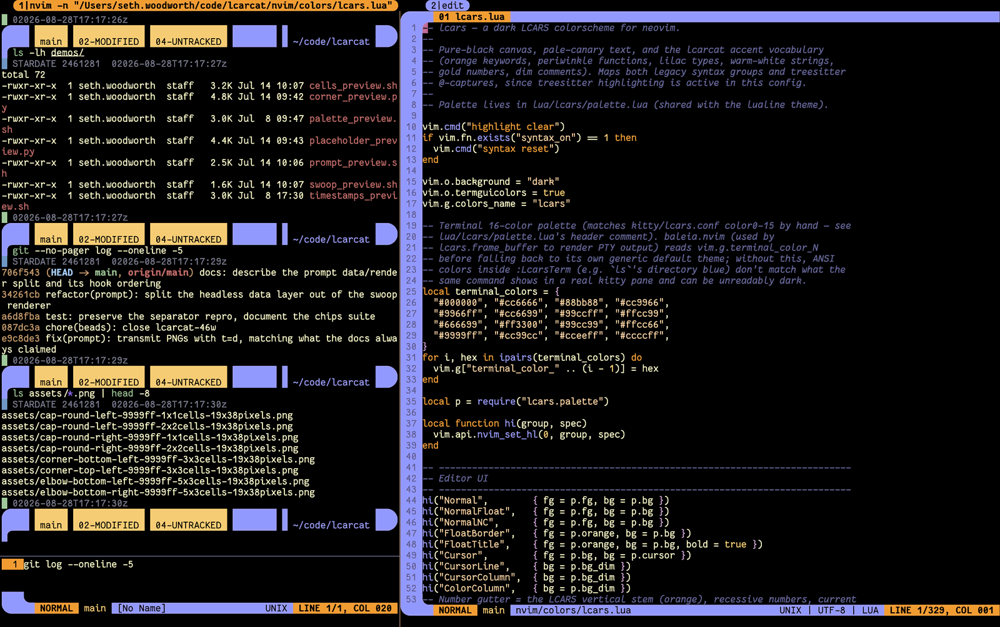
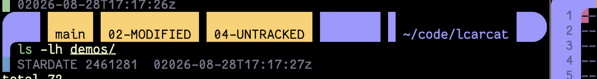
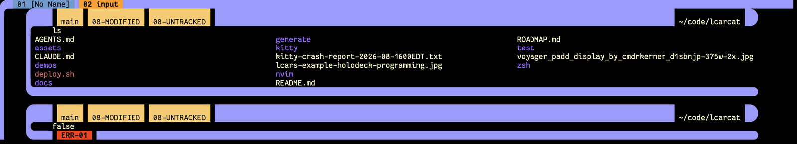

# lcarcat

An LCARS-style UI toolkit for the terminal — building blocks for rendering the
*Library Computer Access/Retrieval System* look (Star Trek's UI) in a shell prompt, a
neovim frame, and other terminal chrome.



## Approach

LCARS is all bold color panels with **rounded elbow** joins and **round cap** ends. A character
grid can't draw curves, so lcarcat splits every element into two kinds of pieces:

- **Flat parts are terminal cells** — filled with a background color (`%K{…}`). They cost
  nothing, flex to any width, and scroll natively. This is the bulk of every panel.
- **Curved parts are images** — small PNGs placed with the kitty graphics protocol, used
  only where a corner or cap actually curves. They are the *only* images we draw.

Keeping the flat mass as cells (not one big PNG) is what makes panels resize with the
terminal, wrap correctly, and stay cheap.

## What's here

### The prompt — LCARS chrome on every command



A **swoop bar** drawn fresh each prompt: rounded elbow, then **chips** carrying whatever is
worth knowing (git branch and working-tree counts, virtualenv, python version, AWS profile,
last exit code), then the path as a **notch**, then a round cap. Only the elbow and the cap
are images. Everything between them is terminal cells, so the bar reflows with the pane.

Commands are bracketed by dim scrollback lines led by a 1-column LED cell — sky at start,
green or red at the end — carrying a STARDATE and a UTC timestamp.

Working and deployed; this is the part that gets daily use. Chip-by-chip breakdown in
[Prompt reference](#prompt-reference) below.

### `:LcarsTerm` — a neovim terminal wrapped in LCARS



A replacement for `:terminal` that renders **each command as a block**: a header bar carrying
the same chips the prompt shows, the command's output framed beneath it, and a footer chip
reporting how it exited (note the red `ERR-01` above).

`:LcarsTerm` renders into a buffer neovim owns, not a passthrough terminal, so the shell's own
bar never reaches the screen — nvim has to draw the chips itself, which means it has to be
*told* what they say. The shell reports its state over escape sequences: OSC 133 for command
boundaries, OSC 7 for the cwd, and **OSC 7447**, a small protocol for the semantic chip data.
The shell names what a chip *means* (`git`, `venv`, `awsdep`); neovim decides what it looks
like. That boundary is specified in [`docs/osc-7447.md`](docs/osc-7447.md), written to stand
on its own.

A working prototype under active development — command blocks, chips and exit status all
render live. Not yet a daily driver: full-screen programs (vim, less, fzf) still need
alternate-screen passthrough, and block navigation and folding are queued.

## Nomenclature

```
  swoop                       chip (B)      chip (B)          fill        chip (A)    cap
 ┌──╮ ┌──────────────────────────────────────────────────────────────────────────────╮
 │  │ │ ███ venv ███ py 3.11 ███ ······· orange bar ······· ███▏black▕ ~/PROJ ▕███    ◗│
 │  │ └──────────────────────────────────────────────────────────────────────────────╯
 │  │   ← stem                                                        notch ↑
 │  •  nested content (input line, timestamps) sits beside the stem
```

### bar
A horizontal LCARS band: a run of terminal cells filled with a single accent color
(`%K{…}`). Full-width and dynamic to `$COLUMNS`; **2 rows tall** by convention. The bar is
the canvas that chips, notches, and caps sit on. Everything flat is "the bar."

### swoop
The curving **elbow** on the left of a bar where the horizontal band turns and drops into a
vertical **stem**. Drawn as a PNG because it curves. Two variants:
- **top swoop** — bar on top, stem descends (opens a frame above output).
- **bottom swoop** — the vertical mirror; stem rises into a bar (closes a frame below output).

Sub-parts of a swoop:
- **elbow** — the corner image: a rounded *outer* corner, the 2-row bar, and a small concave
  *inner fillet* necking down to a 1-row **stem stub** at column 1. It is 3 rows tall
  (bar 2 + stem 1) and generated at exactly that size so the bar rows line up with the cell
  bar — the fillet is the one curve that justifies keeping the stem in the image.
- **stem** — a **1-cell-wide** vertical column at the elbow's column 1. The elbow image
  carries the fillet + stem stub on the first (input) line; below that it continues as a
  colored **background cell** (via `PROMPT2`) down every line of multi-line input. It frames
  the *nested content* (input line, timestamps) that sits just to its right.

### cap
The **right cap** of a bar: a half-round (semicircle) end drawn as a PNG, flat on the left
so it butts seamlessly against the cell bar. The prompt lays **2 bar-color cells** before the
cap so the round end reads as a continuation of the bar, not of the notch. Right-anchored —
on an input line it rides in `RPROMPT`; on a standalone bar it's positioned at the last columns.

### pill
A short standalone segment with a **round cap on *both* ends** (a cell body between two caps) —
as opposed to a *bar*, which is open/elbowed on the left and capped only on the right. A pill
reads as a self-contained button/badge, so it suits a discrete widget rather than the flowing
prompt bar. **Not yet implemented in the zsh prompt** (previewed in `demos/timestamps_preview.sh`).

### chip
A labeled **segment** within a bar. A chip is where information lives. Two styles:

- **Style A — notch chip** (label *in the bar color*, on black).
  Words are cut into the bar as a **black notch** with the text drawn in the bar's own
  accent color. By convention a Style-A chip only appears at the **far right** of a bar,
  introduced by the motif `[1-col black rule][1-col accent][black notch: words]`.

- **Style B — color chip** (dark text on a color).
  A solid colored segment (a different accent than the bar) with the label in **dark/black**
  text. Chips of different accents sit side by side to read as distinct fields, and can be
  **right-justified** within the chip.

**Text alignment (both styles):** horizontally **right-aligned** by convention. Vertically a
label can sit on the **top**, **middle**, or **bottom** row of the bar — **generally bottom**.
(The prompt draws a 2-row bar and puts both the Style-B chip labels and the Style-A path notch
on the bottom row.)

### notch
A black inset carved into a bar (used by Style-A chips) so accent-colored text can be read
against black rather than against the bar fill.

## Terminology cheat-sheet

| term  | what it is                       | rendered as        |
|-------|----------------------------------|--------------------|
| bar   | horizontal accent band           | terminal cells     |
| swoop | left elbow + stem                | PNG (elbow) + cell (stem) |
| stem  | 1-col vertical drop from a swoop | terminal cells     |
| cap   | right half-round end cap         | PNG                |
| pill  | segment capped on both ends (unimpl.) | cells + 2 caps |
| chip  | labeled segment in a bar         | terminal cells     |
| notch | black inset holding accent text  | terminal cells     |

## Repository layout

```
README.md                      this file — approach, features & nomenclature
ROADMAP.md                     state, pending work, key decisions, install steps
AGENTS.md                      working rules for agents (min-viable-image, deploy, style)
deploy.sh                      copy repo -> ~/.config and verify (--dry-run to preview)
docs/                          architecture, protocol spec, design notes, testing
generate/gen_swoops.py         Pillow generator for the elbow + round caps (run via uv)
assets/*.png                   generated caps (elbow-top/bottom, cap-right, legacy swoops)
zsh/lcars_prompt_data.zsh      headless prompt state + OSC feed (no rendering)
zsh/prompt_lcars.zsh           the switchable LCARS prompt (`lcarsprompt on|off`)
nvim/lua/lcars/                the :LcarsTerm frame — PTY, block model, renderer, chrome
nvim/colors/lcars.lua          LCARS colorscheme
kitty/lcars.conf               LCARS 16-color palette + tab-bar/border chrome
kitty/lcarcat.keybindings.conf scrollback prompt-navigation binds
demos/*.sh                     standalone previews (palette, swoop, cells, prompt, timestamps)
test/                          unit suites + kitty screenshot harnesses
```

Run any demo directly, e.g. `bash demos/prompt_preview.sh` (they read from `assets/`).

## Prompt reference

The layout above, in detail. Left to right: **elbow** → **Style-B chips** → orange
**fill** → **Style-A path notch** → 2 bar-color cols → **cap**. Chips ride combed 1-col black
gaps and appear only when relevant:

- **error** — exit code, red chip (color alone signals failure; no glyph).
- **venv** — virtualenv name (or `uv`), lilac.
- **python** — `py <version>` from `.tool-versions`, sky.
- **git** — a gold **branch** chip plus one gold **`NN-WORD`** chip per non-empty state:
  `NN-STAGED`, `NN-MODIFIED`, `NN-UNTRACKED` (full words, zero-padded counts).

The **path** rides the bottom bar row as the Style-A notch; the input line sits below on the
**stem** (an orange background cell + space, no prompt symbol), continued on multi-line input
via `PROMPT2`.

The bracketing scrollback lines are led by a **1-col LED cell** (a background cell, not a
glyph):
- **start** — sky LED, `STARDATE <Julian Day Number>` + UTC datetime (`0yyyy-mm-ddTHH:MM:SSz`).
- **end** — green (ok) / red (fail) LED, UTC datetime, and duration when over threshold.

Falls back to a plain two-line zsh prompt outside kitty (tmux/ssh). Toggle: `lcarsprompt on|off`.

**Two files, one prompt.** `zsh/lcars_prompt_data.zsh` decides what the prompt *knows* and
reports it over escape sequences without drawing anything — that headless layer is what
`:LcarsTerm` consumes. `zsh/prompt_lcars.zsh` draws the bar on top of it. Deploy both;
architecture in [`docs/zsh-prompt.md`](docs/zsh-prompt.md).

## Status

Extracted from a personal kitty + zsh LCARS setup, and still shaped by it. Targets **kitty**
(graphics protocol for the curved caps), **zsh** (prompt integration), and **neovim** (the
terminal frame).

Roughly where things stand:

| Piece | State |
|-------|-------|
| Swoop prompt | Working, deployed, in daily use |
| kitty theme + tab pills | Working |
| Asset generator (`gen_swoops.py`) | Working; regenerates on cell-size change |
| `:LcarsTerm` frame | Working prototype — blocks, chips, exit status render live |
| OSC 7447 protocol | Specified and versioned; one emitter, one consumer |
| Packaging / install | Manual (`deploy.sh` into `~/.config`); not a plugin yet |

**Direction.** The prompt is largely done, and the centre of gravity has moved to the neovim
frame — making `:LcarsTerm` complete enough to live in, which mostly means handling the things
a real terminal has to handle: full-screen programs, scrollback navigation, multiple sessions.
Underneath that, the shell/editor boundary is being treated as a real interface rather than an
implementation detail, which is what [`docs/osc-7447.md`](docs/osc-7447.md) is about.

The longer-term itch is packaging: right now this is a repo you copy into `~/.config`, and it
should be something you can install.

See **`ROADMAP.md`** for the full state, pending work, and install steps.
